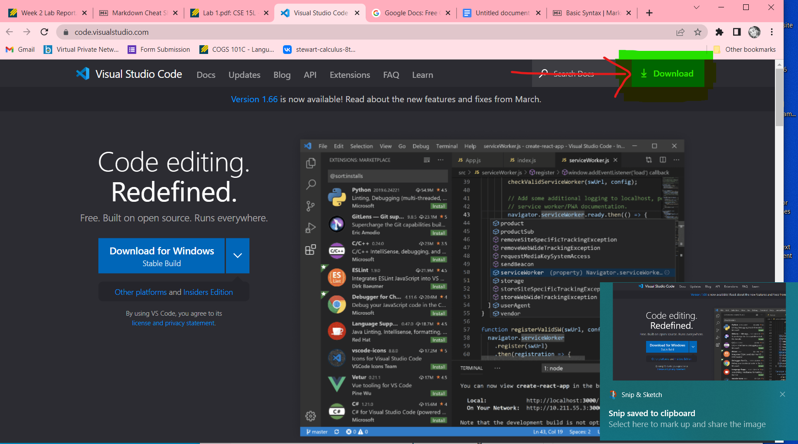
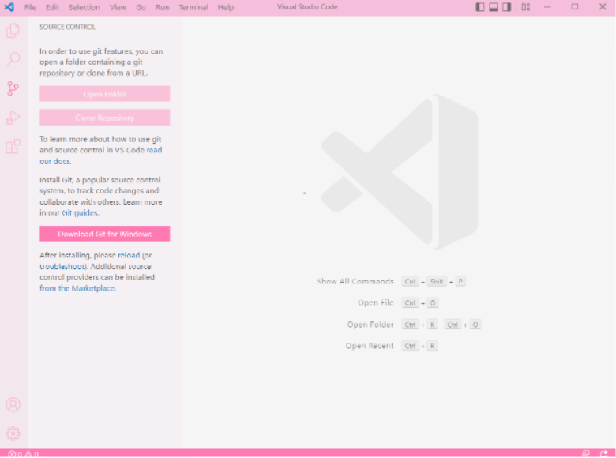
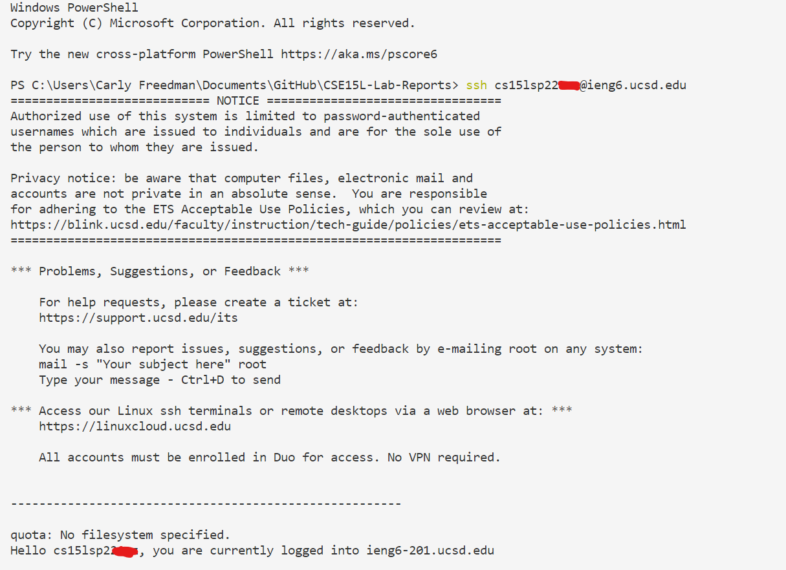
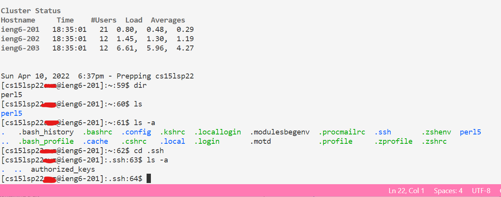
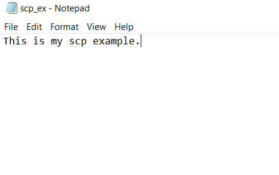
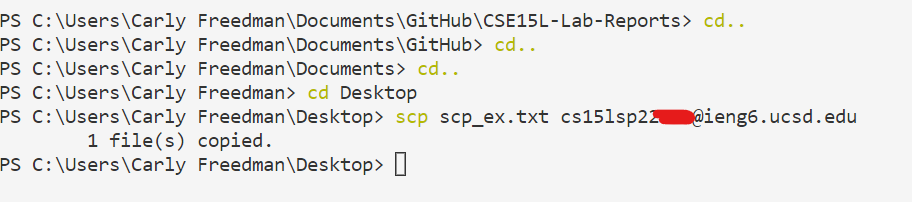
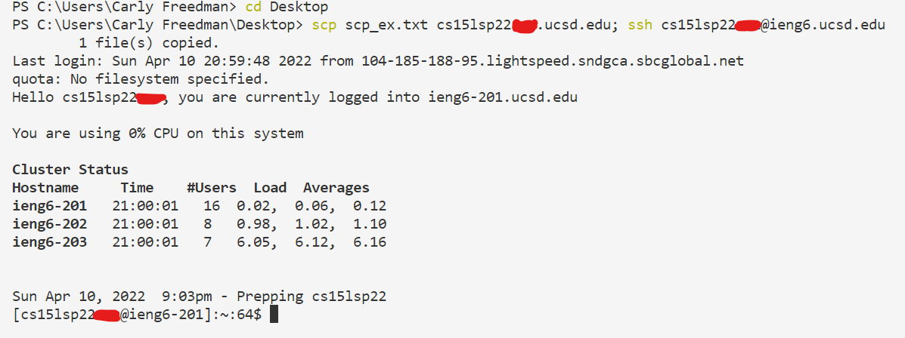

# How to Access a Course-Specific Account on ieng6
**Step 1-** Installing VSCode

>You can download VSCode 
[here. ](https://code.visualstudio.com) Click the Download button as shown below.
>
>Once it is downloaded, you will be walked through the install. Once it is installed, your screen should look similar to this:
>

**Step 2-** Remotely Connecting

> Ensure that you have OpenSSH installed, and if not [install it.](https://docs.microsoft.com/en-us/windows-server/administration/openssh/openssh_install_firstuse) Ensure that you have your course-specific account for CSE 15L and if not [find it.](https://sdacs.ucsd.edu/~icc/index.php) 
>
>Once you have both of these things, open a terminal using the Terminal-> New Terminal option in VSCode. The command to open a remote connection is as follows (Note: replace 'zz' with your own course-specific account ID):
    >>ssh cs15lsp22zz@ieng6.ucsd.edu
>
>If this is your first time connecting, you will be prompted for a password. Leave this field blank.
>
>Once you are fully connected, you should receive the following output or something similar.
>

**Step 3-** Trying Some Commands

>Now that you are connected, you can try out some commands. Some examples of some commands you might want to try are ls, ls -a, dir, and cd. The output should look something like the following:
>

**Step 4-** Moving Files With scp

>Now we will see how to copy a file from your local computer over to the server you connect to remotely. 
>
>Start by creating a file on your local machine and take note of where you save it (I chose my Desktop). I am creating a text file called "scp_ex.txt" that looks like this: 
>
>Next, you must return to the VSCode terminal and type in the following command, except replace [path] with the path to your file, and 'zz' with your own personal ID.
>> scp [path] cs15lsp22zz@ieng6.ucsd.edu:~/
>>
>The output should resemble the following:
>

**Step 5-** Setting an ssh key

>Next, we want to set up an ssh key so that you do not need to keep entering your password each time you wish to connect to this server remotely.
>
>In order to do this, you must type in the following command:
>> ssh-keygen
>
>You will then be asked to enter the file you wish to save to. You must respond with the following:
>>/Users/[user-name]/.ssh/id_rsa
>
>Except [user-name] should be replaced by your own username on your personal machine.
>
>Now, you must create a .ssh directory on the server you are connecting to. Remotely connect to the server again and type the following command:
>> mkdir .ssh
>
>Then, logout and return to your local machine. Then use the following command to copy the file from your local machine into the directory you just created on the server. 
>>scp /Users/[user-name]/.ssh/id_rsa.pub cs15lsp22zz@ieng6.ucsd.edu:~/.ssh/authorized_keys
>
>Except [user-name] shouold be replaced by your own username on you personal machine, and 'zz' should be replaced by your own personal ID number.
>
>Now you should be able to connect remotely to the machine without having to enter your password, and it should look something like this:
>

**Step 6-** Optimizing Remote Running

>You can optimize remote running by typing multiple commands in one line. In order to do this you must separate each command with a semicolon. For example, you can copy a file over to the server and then connect remotely via ssh all in one line, like so:
>
