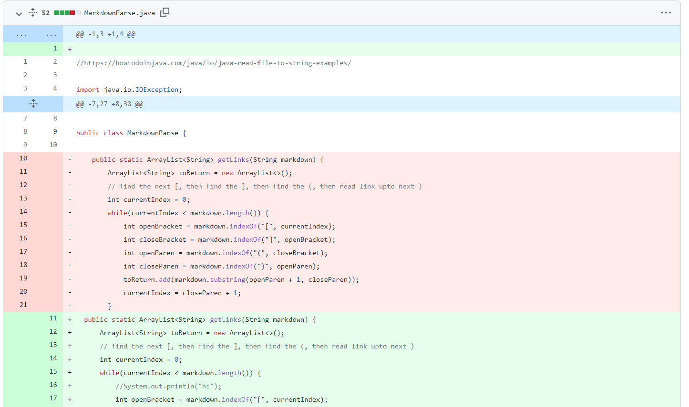
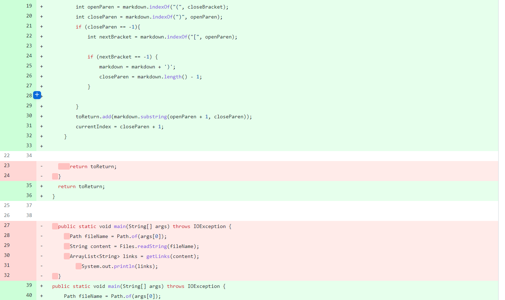
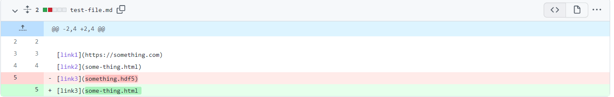
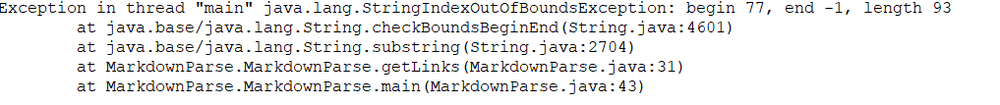

# Lab Report 2 Week 4

## Breaking Test Case 1:

>Code change Diff:
>
>
>
>[Link to failing test case](https://github.com/Carly-Freedman/markdown-parser/blob/main/test-file1.md)
>
>Symptom:
>
>
>The failure inducing input contains a link without a closing bracket. So, the bug is that the program has no final parenthesis to find, causing it to search for a substring starting at an index of -1 which does not exist. Therefore, we receive the symptom of the IndexOutOfBounds Error. 

