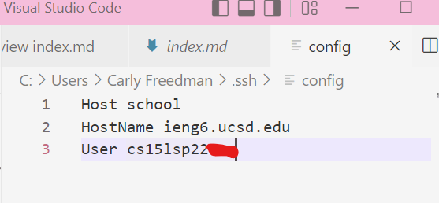
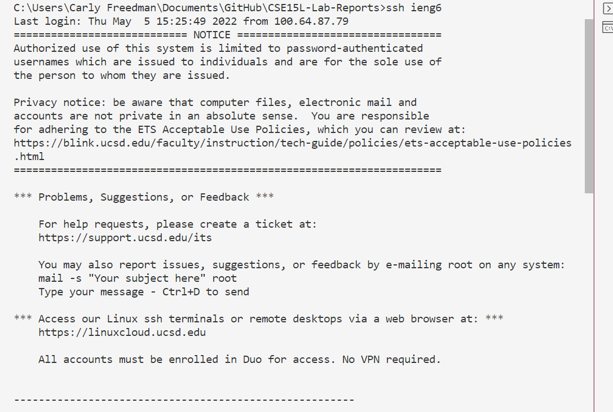
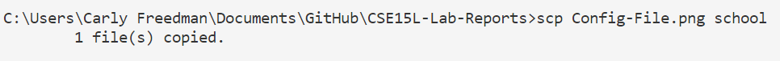
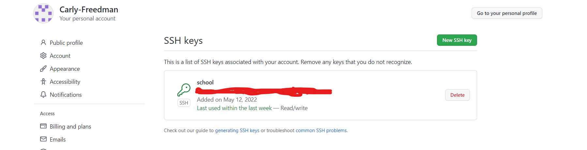
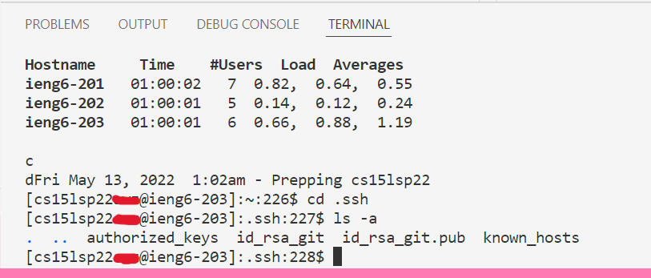
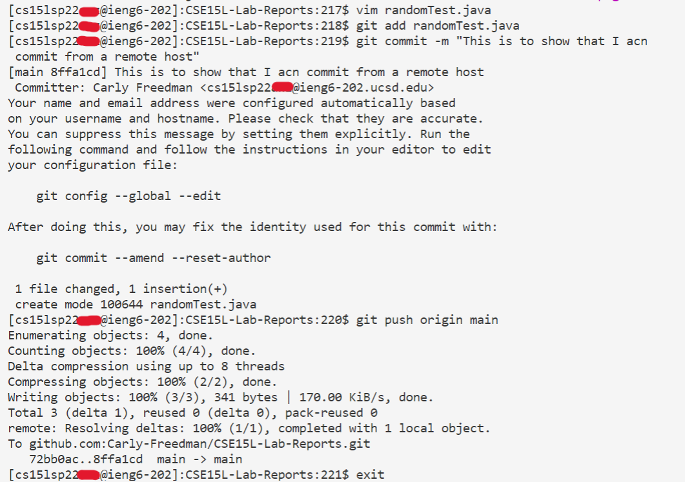
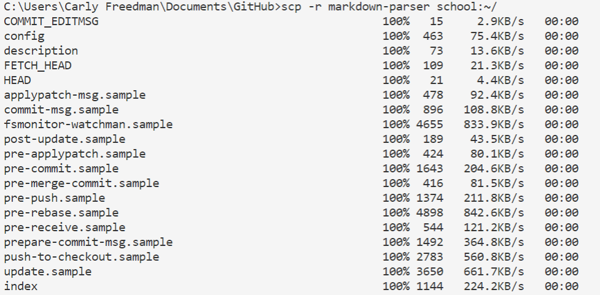
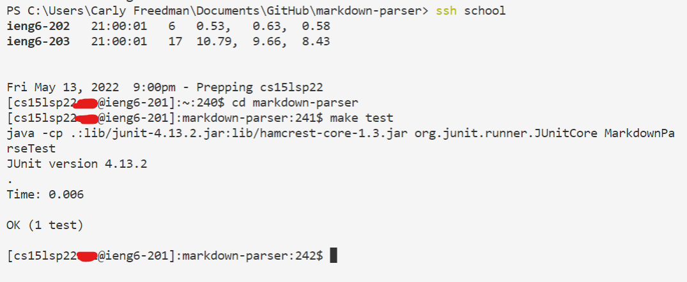
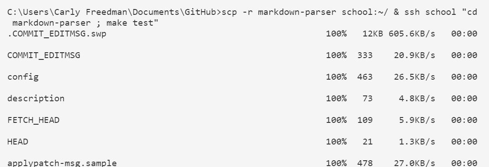

# Lab Report 3 Week 6
## Streamlining ssh Configuration
>
>
>>First, I set the config file to allow me to refer to my server login as "school" for ssh purposes
>
>
>
>>Here, you can see that I have successfully enabled the shortcut to allow me to ssh to the school computer by using the command "ssh school."
>
>
>
>>Here, you can see that I have successfully enabled the shortcut to allow me to scp to the school computer by using the command "scp school."

## Setup Github Access from ieng6
>
>
>>I saved the public key I created on the ieng6 server into Github.
> 
>
>
>>Here, you can see where I have saved my private ssh key in the ieng6 server. 
>
>
>
>>Here, you can see I am now able to add, commit, and push files to github from the ieng6 server.
>
>[Link to Commit](https://github.com/Carly-Freedman/CSE15L-Lab-Reports/commit/8ffa1cd6c736ccbfac77bfbbdfed80d2f902a593)

## Copy Whole Directories with scp -r
>
>
>>I successfully copied my entire markdown-parser directory recursively from my local machine to the ieng6 server.
>
>
>
>>Now, I have logged in to school and run the MarkdownParse tests using "make."
>
>
>
>>Here, you can see I successfully copied the markdown-parser directory over to the school server, logged into the ieng6 server, and ran the "make" tests, all in one single line. 

