# Lab Report 4 Week 8
## My Tests:
### Test 1:
>Below is the function I wrote to test the first test case with my markdown-parser.
>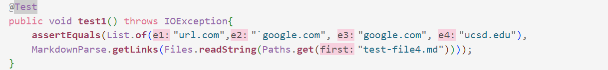
>For the first test case, I decided to use the expected results highlighted in the photo below.
>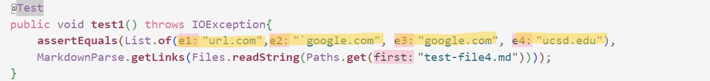
>The tests from the first test file all passed.

### Test 2:
>Below is the function I wrote to test the second test case with my markdown-parser.
>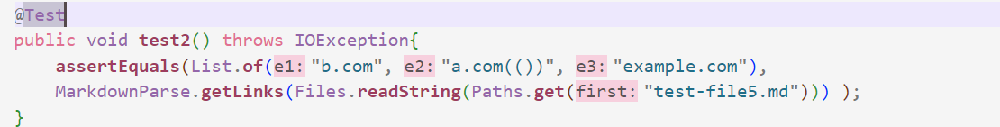
>For the second test case, I decided to use the expected results highlighted in the photo below.
>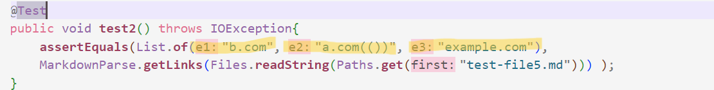
>As you can see in the photo below, there was an error while running the tests in the second test file. The first and second outputs did not match those expected.
>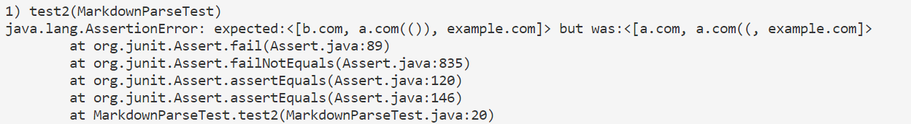

### Test 3:
>Below is the function I wrote to test the third test case with my markdown-parser.
>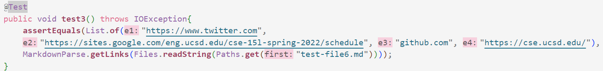
>For the third test case, I decided to use the expected results highlighted in the photo below.
>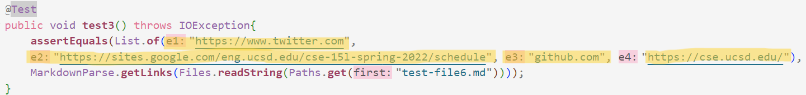
>As you can see in the photo below, there was an error while running the tests in the third test file. The program got stuck in a loop and did not finish running.
>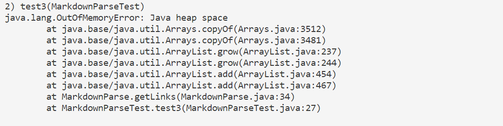
## Tests from Week 7 Partner:
### Test 1:
>Below is the function I wrote to test the first test case with my partner from week 7's markdown-parser.
>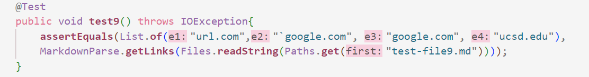
>For the first test case, I decided to use the expected results highlighted in the photo below.
>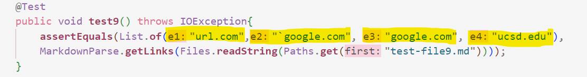
>The tests from the first test file all passed.
### Test 2:
>Below is the function I wrote to test the second test case with my partner from week 7's markdown-parser
>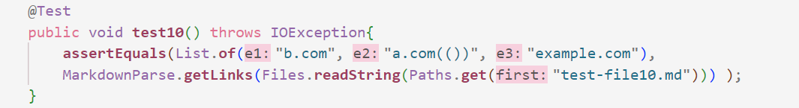
>For the second test case, I decided to use the expected results highlighted in the photo below.
>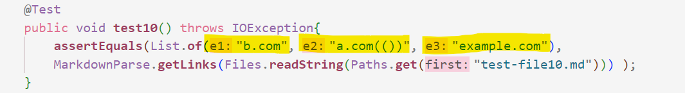
>As you can see in the photo below, there was an error while running the tests in the second test file. None of the outputs matched those expected.
>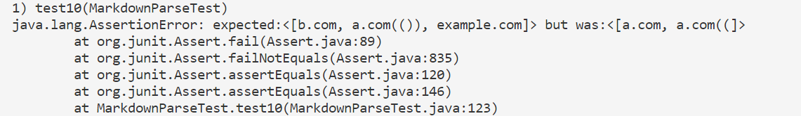
### Test 3:
>Below is the function I wrote to test the second test case with my partner from week 7's markdown-parser
>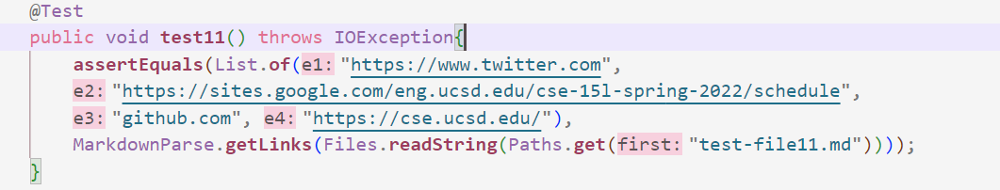
>For the third test case, I decided to use the expected results highlighted in the photo below.
>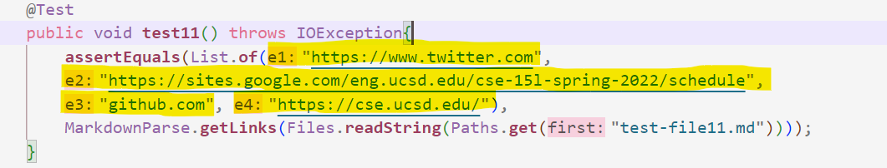
>As you can see in the photo below, there was an error while running the tests in the third test file. None of the outputs matched those expected.
>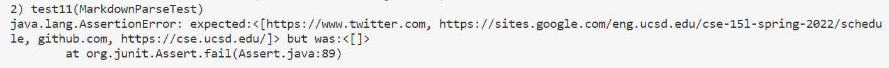