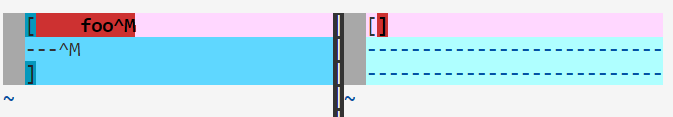

# Lab Report 5 Week 10
## Finding Tests With Different Outputs
> I used a for loop in a bash script running vim diff on the outputs of each test from each implementation of MarkdownParse. Here you can see the script I used:
>
>I determined that two files which have differences in output between the implementations of MarkdownParse are [10.md](https://github.com/nidhidhamnani/markdown-parser/blob/main/test-files/10.md) and [100.md](https://github.com/nidhidhamnani/markdown-parser/blob/main/test-files/100.md).

## Differing Test 1: 10.md
>The test should output nothing. There are no valid links in the test file. The provided implementation correctly returned no links. My implementation incorrectly returned an invalid link.
>
>My Implementation Output (Left) Vs Provided Implementation Output (Right):
>
>
>In my MarkdownParse.java, the place where the bug is occurring is highlighted in the following photo.
>
>If I went in and corrected this section of the program to recognize a line without a opening parenthesis as an inaccurate link, as opposed to appending the parenthesis and continuing on. 

## Differing Test 2: 100.md
>The test should output nothing. There are no valid links in the test file. The provided implementation correctly returned no links. My implementation incorrectly returned an invalid link.
>
>My Implementation Output (Left) Vs Provided Implementation Output (Right):
>
>
>In my MarkdownParse.java, the place where the bug is occurring is highlighted in the following photo.
>
>If I went in and corrected this section of the program to recognize a line without a closing parenthesis as an inaccurate link, as opposed to appending the bracket and continuing on. 

